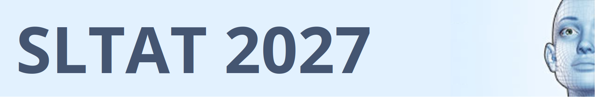

# SLTAT 2027: 11th conference on Sign Language Translation and Avatar Technologies

The [SLTAT history](http://sltat.cs.depaul.edu) began in 2011 in Berlin, Germany. For 10 occurrences since, it has hosted academic and technical presentations addressing Sign Language processing and technology. This is the web page for the 11th edition, taking place **October 13 and 14, 2027 in Université Paris-Saclay**.

The planned format for this next edition is a two-day conference, with a desire to increase the connection between \[turn to left of signing space] the scientific and engineering work on Sign Language, and \[turn to right of signing space] the target users and signers.
Grossly, the first day will follow a traditional academic programme, with selected oral and poster presentations. The second will place higher focus on usage and users. 

Submissions are invited on any original academic work on Sign Language technology, as well as theoretical input to computer processing of Sign Language.
This page will be updated ahead of the deadline with the submission process.

## Dates 
- Paper submission deadline: **28/05/2027**, anywhere on Earth
- Notification of acceptance: to be announced
- Camera-ready submission deadline: to be announced
- Submission of slides for interpreters' preparation (oral presentations only): to be announced
- Conference days: 13–14/10/2027

## Venue, access, accommodation

[Laboratoire Interdisciplinaire des Sciences du Numérique (LISN)](https://www.lisn.upsaclay.fr/), "Digiteo" building, **Shannon lecture room**
Address: Université Paris-Saclay, bâtiment 660, 1 rue René Thom, Gif-sur-Yvette, France

Useful (anticipated) news: the new metro line 18 is opening December 2026. It will provide direct access to the venue from the Massy-Palaiseau station (many accommodation options there, and a short train ride from Paris). Station "Université Paris-Saclay" will be a mere 5 minutes away from the lecture room.
Currrent tips on [access to LISN](https://www.lisn.upsaclay.fr/le-laboratoire/acces/), see section on "site Plaine" and "Digiteo" building.
Nearby hotels are also listed on that page.

## Languages

The conference languages are English and International Sign.

The oral/signed presentations will be interpreted into/from International Sign. The International Sign interpreters will also be around for the poster sessions to help out where necessary.

Participants are welcome to bring interpreters for other Sign languages, and are kindly encouraged to warn us of it for room set-up purposes.

## Contact & committees

The organizing committee can be reached by email at the following address: sltat@lisn.fr

The reviewing and programme committees will be constituted and posted here soon.
